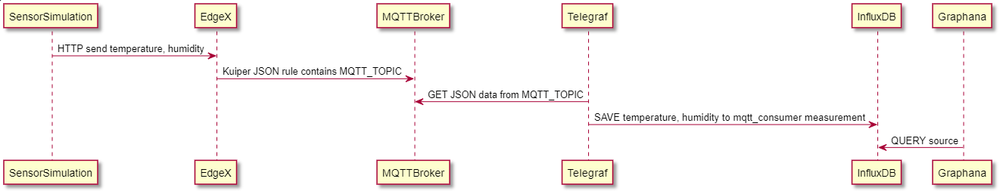
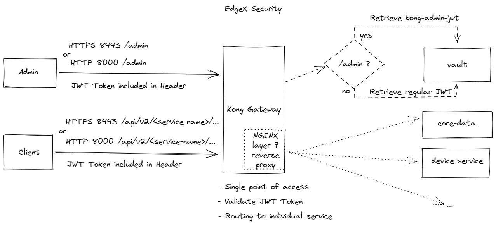
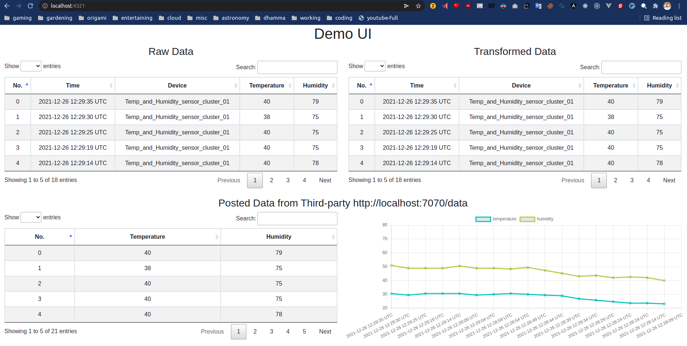
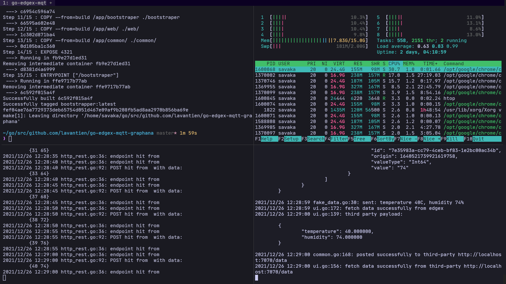
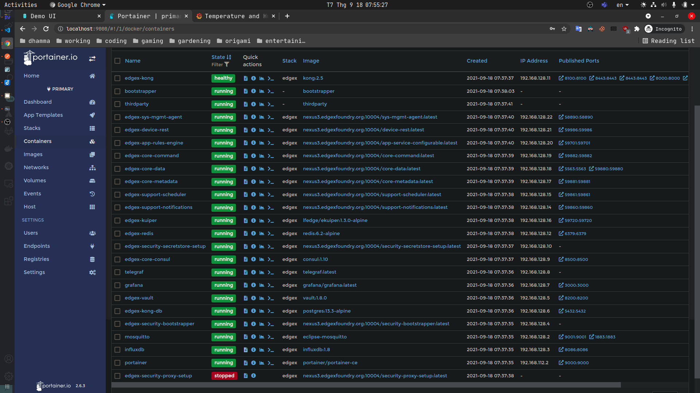
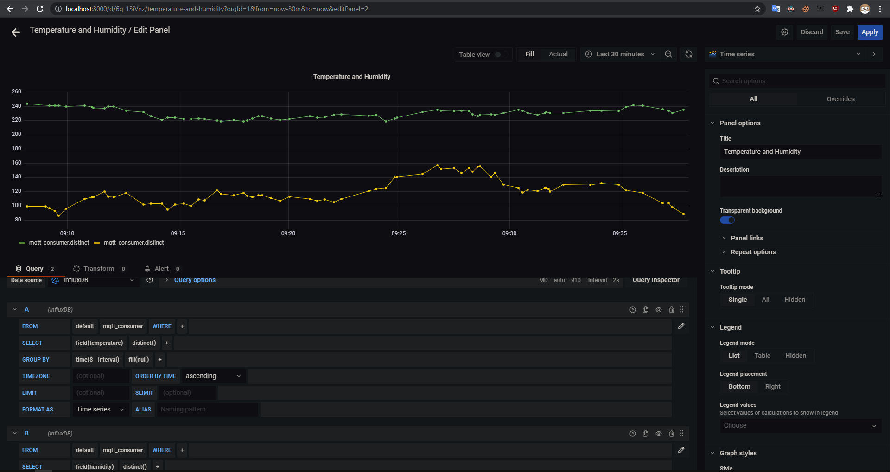
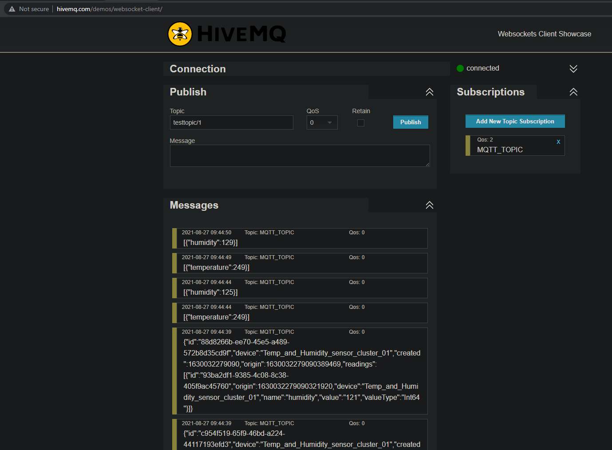
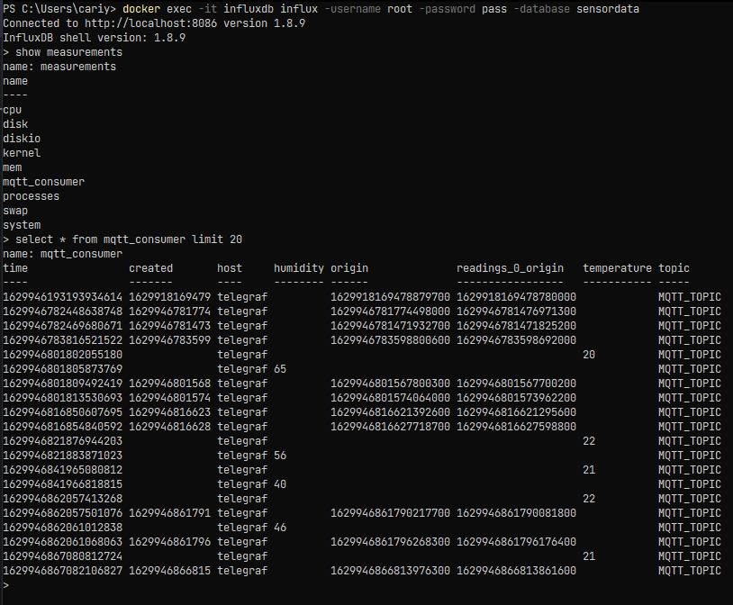
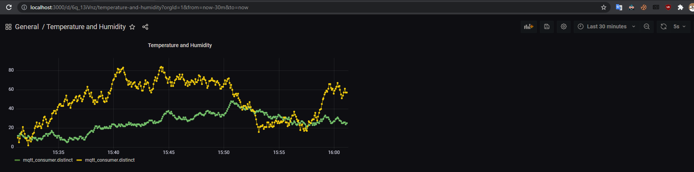

# EdgeX 2 Docker Setup Demo v2

An EdgeX Docker based Edge microservices mesh system, with fake sensors, pure Go bootstrapper, pseudo-thirdparty and web UI. Integrated with Mosquitto MQTT, Telegraf, InfluxDB, and Grafana visualization

## Target

1. Provide clear instruction on how to run and monitor an EdgeX system on local machine
2. Cover two use cases of proxy public MQTT broker (HiveMQ) and dedicated MQTT broker (Mosquitto)
3. Using Telegraf to probe data from the broker and save it into InfluxDB
4. Using Grafana to visualize sensor's data gather from InfluxDB
5. Provide a single bootstrapping point with containerization for seamless integration with full compliance with EdgeX 2.0 breaking changes
6. Simple UI for aggregating Data
7. Integrate with EdgeX's Kong Gateway API using JWT token
8. Integrate with Third-party API using JWT Token

## Todo

1. Integrate with Third-party API using JWT Token via EdgeX's Application Service
2. Implement a wait mechanism for checking whether EdgeX is usable or not before bootstrapping, instead of using magic number (currently it's 15 seconds - see `Makefile`)
3. (LOW) Transforming sensor data using EdgeX's Application Service and Rule Engine

## Requirements not cover in this setup

1. `Ubuntu 20.04 LTS` or `Windows 10` & `WSL2`
2. `Docker` & `docker-compose` installed, in `Windows 10` it will all included in `Docker Desktop`
3. `Postman`, `Insomnia` or `CURL+jq` installed
4. `Go 1.16+` installed, `1.16+` for the `embed` feature

## Repository

- `git clone https://github.com/lavantien/go-edgex-mqtt-graphana.git`

## Sequence Flow





## Init

```bash
# Pull the containers and list the newly downloaded images
# Start EdgeX Foundry using docker-compose
# Also start the bootstrap and thirdparty containers
make run

# To clean up all images, containers and volumes on the system
# docker system prune -a

# View the running containers and their ports
make ps
# View bootstrappper's logs
make logs-bootstrapper
make start-bootstraper
make stop-bootstraper
# quick remove and restart bootstraper for development purpose
make reload
# View thirdparty's logs
make logs-thirdparty
make start-thirdparty
make stop-thirdparty
# Stop and remove all inactive containers
make stop

# Stop and remove all
make clean
```

## Demonstrating

### View the Demo UI

- `http://localhost:4321`





## Accessing the UIs

### View the status of the microservices via the Portainer web interface

- `http://localhost:9000`
- Enter new password, must be not longer than 5 minutes after the services start or else the Portainer will close
- See if all of the services are green



### View Grafana UI

- "`http://localhost:3000`" with "`admin:admin`" and "`Skip`" change password
- After logging in, add an "`InfluxDB`" data source with these parameters:

```config
    URL:       http://influxdb:8086
    Database:  sensordata
    User:      root
    Password:  pass
```

- Click "`Connect`" and verify that the datasource is successfully added
- Back to Grafana Home, click "`Create your first dashboard`" and "`Add new panel`"
- In the `FROM` clause, after "`default`", click and select "`mqtt_consumer`"
- In the "`SELECT`" clause, "`field`" is "`temperature`", and click the + sign, type in "`distinct`" and select
- Select the time range to "30 minutes" and click "Apply"
- Click duplicate query and change "`field`" to "`humidity`" for the "`humidity`" line
- After finish all the step in this document you should be seeing this graph after it running for a while


## Testing the setup to make sure everything work properly

- Postman GET `http://localhost:59880/api/v2/ping`

```json
{
    "apiVersion": "v2",
    "timestamp": "Wed Sep 15 05:18:22 UTC 2021"
}
```

- The Mapping (more at ):

```table
Microservice Host Name      Port number Partial URL
edgex-core-data             59880       core-data
edgex-core-metadata         59881       core-metadata
edgex-core-command          59882       core-command
edgex-support-notifications 59860       support-notifications
edgex-support-scheduler     59861       support-scheduler
edgex-kuiper                59720       rules-engine
device-rest                 59986       device-rest
```

## Import `v2.postman_collection.json` collection into to Postman

- Replace the `jwt` variable generated each time the EdgeX boot up, the JWT Token will be store in `jwt_token` file, every request from the collections will inherit this very same JWT Token.
- Run the requests sequently to setup the fake device and MQTT rules

### Ping all of the necessary services

- Postman GET `http://localhost:8000/core-data/api/v2/ping`
- Postman GET `http://localhost:8000/core-metadata/api/v2/ping`
- Postman GET `http://localhost:8000/device-rest/api/v2/ping`
- Postman GET `http://localhost:8000/rules-engine/ping` **Beware: there is no /api/v2 here**

### Setting up the device and MQTT feature (it already automatically run with the bootstraper)

- Upload the device profile:
  Postman POST `http://localhost:8000/core-metadata/api/v2/deviceprofile/uploadfile`
  Body form-data file sensorClusterDeviceProfile.yaml

```yaml
name: "SensorCluster"
manufacturer: "Raspberry Pi Foundation"
model: "Raspberry Pi 3b+"
labels:
  - "rpi"
description: "Sensor cluster providing metrics for temperature and humidity"

deviceResources:
  -
    name: temperature
    description: "Sensor cluster temperature values"
    properties:
      valueType: "Int64"
      readWrite: "RW"
      minimum: "-50"
      maximum: "100"
      defaultValue: "9"
  -
    name: humidity
    description: "Sensor cluster humidity values"
    properties:
      valueType: "Int64"
      readWrite: "RW"
      minimum: "0"
      maximum: "100"
      defaultValue: "9"

deviceCommands:
  -
    name: combine
    readWrite: "RW"
    resourceOperations:
      - { deviceResource: "temperature" }
      - { deviceResource: "humidity" }
```

- Create device:
  Postman POST `http://localhost:8000/core-metadata/api/v2/device`
  Body raw JSON

```json
[
    {
        "apiVersion": "v2",
        "device": {
            "name": "Temp_and_Humidity_sensor_cluster_01",
            "description": "Raspberry Pi sensor cluster",
            "adminState": "UNLOCKED",
            "operatingState": "UP",
            "labels": [
                "Humidity sensor",
                "Temperature sensor",
                "DHT11"
            ],
            "location": "{lat:45.45,long:47.80}",
            "serviceName": "device-rest",
            "profileName": "SensorCluster",
            "protocols": {
                "example": {
                    "host": "dummy",
                    "port": "1234",
                    "unitID": "1"
                }
            }
        }
    }
]
```

- Create a Kuiper Stream
  Postman POST `http://localhost:8000/rules-engine/streams`
  Body raw JSON

```json
{
    "sql": "create stream MQTT_TOPIC() WITH (FORMAT=\"JSON\", TYPE=\"edgex\")"
}
```

- Create a Kuiper Rule
  Postman POST `http://localhost:8000/rules-engine/rules`
  Body raw JSON

```json
{
    "id": "mqtt_export_rule",
    "sql": "SELECT * FROM MQTT_TOPIC",
    "actions": [
        {
            "mqtt": {
                "server": "tcp://mosquitto:1883",
                "topic": "MQTT_TOPIC",
                "username": "someuser",
                "password": "somepassword",
                "clientId": "someclientid"
            }
        },
        {
            "log": {}
        }
    ]
}
```

## Job of the `go_api/sensor/fake_data.go` is to periodically send data to the EdgeX as a fake sensor

### Manually send temperature and humidity value as combine command to device

- Postman POST `http://localhost:8000/core-data/api/v2/event/SensorCluster/Temp_and_Humidity_sensor_cluster_01/combine`
- Body raw JSON

```json
{
    "apiVersion": "v2",
    "event": {
        "apiVersion": "v2",
        "deviceName": "Temp_and_Humidity_sensor_cluster_01",
        "profileName": "SensorCluster",
        "sourceName": "combine",
        "id": "{{$randomUUID}}",
        "origin": 1631893656,
        "tags": {
            "Gateway": "HoustonStore-000123",
            "Latitude": "45.450000",
            "Longitude": "47.800000"
        },
        "readings": [
            {
                "deviceName": "Temp_and_Humidity_sensor_cluster_01",
                "resourceName": "temperature",
                "profileName": "SensorCluster",
                "id": "{{$randomUUID}}",
                "origin": 1631893656,
                "valueType": "Int64",
                "value": "1"
            },
            {
                "deviceName": "Temp_and_Humidity_sensor_cluster_01",
                "resourceName": "humidity",
                "profileName": "SensorCluster",
                "id": "{{$randomUUID}}",
                "origin": 1631893656,
                "valueType": "Int64",
                "value": "2"
            }
        ]
    }
}
```

### The event counter count when data is sent to EdgeX it's registered as an event

- Postman GET `http://localhost:8000/core-data/api/v2/event/count`

```json
{
    "apiVersion": "v2",
    "statusCode": 200,
    "Count": 965
}
```

### View the data stored in the EdgeX Foundry Redis DB

- Postman GET `http://localhost:8000/core-data/api/v2/event/all?limit=-1`
- Result Body JSON

```json
{
    "apiVersion": "v2",
    "statusCode": 200,
    "events": [
        {
            "apiVersion": "v2",
            "id": "30c8be9c-622d-4d86-806e-f0233f90da61",
            "deviceName": "Temp_and_Humidity_sensor_cluster_01",
            "profileName": "SensorCluster",
            "sourceName": "combine",
            "origin": 1631926737161081106,
            "readings": [
                {
                    "id": "4659a156-54b2-445c-b64f-f667bbd158ae",
                    "origin": 1631926737161081106,
                    "deviceName": "Temp_and_Humidity_sensor_cluster_01",
                    "resourceName": "temperature",
                    "profileName": "SensorCluster",
                    "valueType": "Int64",
                    "value": "35"
                },
                {
                    "id": "e9510a0e-ebd8-4711-9941-9c080a7f8cc3",
                    "origin": 1631926737161081106,
                    "deviceName": "Temp_and_Humidity_sensor_cluster_01",
                    "resourceName": "humidity",
                    "profileName": "SensorCluster",
                    "valueType": "Int64",
                    "value": "75"
                }
            ],
            "tags": {
                "Gateway": "MarsColony-12345",
                "Latitude": "45.450000",
                "Longitude": "47.470000"
            }
        },
        {
            "apiVersion": "v2",
            "id": "983b04d9-9d07-4f97-8e0f-749cc5c989a7",
            "deviceName": "Temp_and_Humidity_sensor_cluster_01",
            "profileName": "SensorCluster",
            "sourceName": "combine",
            "origin": 1631926732155307388,
            "readings": [
                {
                    "id": "ab7227ed-b0d5-4bbc-83a9-a9b8ccb019ae",
                    "origin": 1631926732155307388,
                    "deviceName": "Temp_and_Humidity_sensor_cluster_01",
                    "resourceName": "temperature",
                    "profileName": "SensorCluster",
                    "valueType": "Int64",
                    "value": "34"
                },
                {
                    "id": "ea70a65e-5de0-4032-ac81-f2c30be0b605",
                    "origin": 1631926732155307388,
                    "deviceName": "Temp_and_Humidity_sensor_cluster_01",
                    "resourceName": "humidity",
                    "profileName": "SensorCluster",
                    "valueType": "Int64",
                    "value": "74"
                }
            ],
            "tags": {
                "Gateway": "MarsColony-12345",
                "Latitude": "45.450000",
                "Longitude": "47.470000"
            }
        }
    ]
}
```

## Proxy MQTT Client

- `http://www.hivemq.com/demos/websocket-client/`
- With default values, click "`Connect`"
Click "`Add New Topic Subscription`", fill the input with this value MQTT_TOPIC, and click "`Subscribe`"


## Mosquitto MQTT Client

- In the mosquitto.conf file

```conf
listener 1883
allow_anonymous true
persistence false
log_dest stdout
```

- Check Portainer or open another terminal window for monitoring the mosquitto logs

```bash
docker logs mosquitto -f
```

## Integrate Telegraf as a bridge between MQTT Broker and InfluxDB

- `In the telegraf.conf file`

```conf
[agent]
  interval = "1s"
  round_interval = true
  metric_batch_size = 1000
  metric_buffer_limit = 10000
  collection_jitter = "0s"
  flush_interval = "10s"
  flush_jitter = "0s"
  precision = ""
  hostname = ""
  omit_hostname = false

[[outputs.influxdb]]
  urls = ["http://influxdb:8086"]
  database = "sensordata"
  skip_database_creation = true
  username = "root"
  password = "pass"

[[inputs.mqtt_consumer]]
  servers = ["tcp://mosquitto:1883"]
  #servers = ["tcp://broker.hivemq.com:1883"]
  topics = [
    "MQTT_TOPIC"
  ]
  data_format = "json"

# Read metrics about cpu usage
[[inputs.cpu]]

# Read metrics about memory usage
[[inputs.mem]]

# Get the number of processes and group them by status
[[inputs.processes]]

# Read metrics about system load & uptime
[[inputs.system]]
```

- Check Portainer or open another terminal window for monitoring the telegraf logs

```bash
docker logs telegraf -f
```

## Verifying that InfluxDB is receiving the data

- Check Portainer or open another terminal window for monitoring the influxdb logs

```bash
docker logs influxdb -f
```

- Query the influxdb database in another terminal tab

```bash
docker exec -it influxdb influx -username root -password pass -database sensordata
show measurements
select * from mqtt_consumer limit 20
```



## Verifying that Grafana UI is visualizing the "Temperature and Humidity" graph



## References

- EdgeX Foundry Hands-on Tutorial v1.1 (<https://docs.edgexfoundry.org/2.0/examples/LinuxTutorial/EdgeX-Foundry-tutorial-ver1.1.pdf>)
- How to visualize Sensor data using Grafana and InfluxDB (<https://gabrieltanner.org/blog/grafana-sensor-visualization>)
- Running the eclipse-mosquitto MQTT Broker in a docker container (<https://blog.feabhas.com/2020/02/running-the-eclipse-mosquitto-mqtt-broker-in-a-docker-container/>)
- Use multi-stage builds (<https://docs.docker.com/develop/develop-images/multistage-build/>)
- EdgeX 2.0 Documentation (<https://docs.edgexfoundry.org/2.0/>)
- EdgeX Security Overview (Included PDF file from the root directory)
